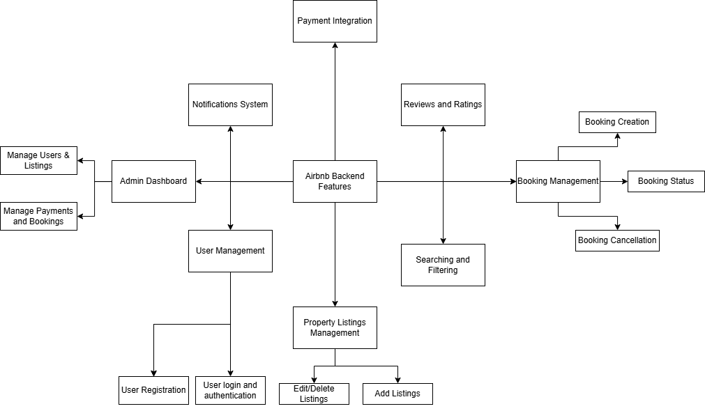

# Backend Features and Functionalities

This document outlines the key features and backend modules of the Airbnb Clone project.

## Overview

The PNG diagram included in this directory provides a structured breakdown of all core functionalities supported by the backend, including:

- User registration, login, and role management
- Property listing and availability management
- Search and filtering system
- Booking creation, tracking, and cancellation
- Secure payment processing
- Review and rating system
- User messaging system
- Notification handling
- Admin dashboard for managing the platform

## File

- `features-diagram.png`: Visual representation of backend features and their relationships.

## Notes

This visual serves as a reference for development and design alignment. All functionalities are based on the project specification for the ALX Airbnb Clone backend.

---

## Diagram

