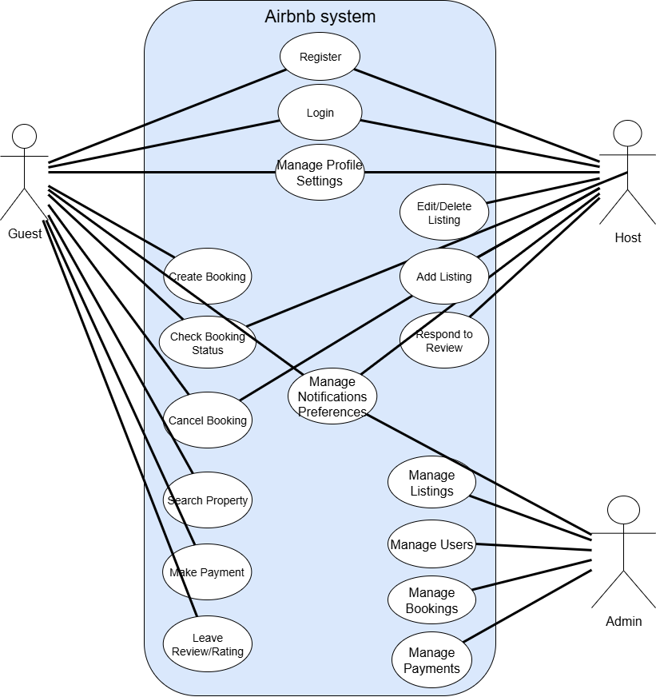

# Airbnb Clone – Use Case Diagram

This diagram represents the key use cases for the backend of the Airbnb Clone project.

## 📌 Overview

The system supports three main actors:

- **Guest** – can register, log in, search for properties, make bookings, manage bookings, make payments, leave reviews, and receive notifications.
- **Host** – can register, log in, manage their profile, add/edit/delete listings, respond to reviews, and receive notifications.
- **Admin** – can log in and manage users, listings, bookings, payments, and system notifications.

## 🧩 Diagram Contents

The diagram illustrates the interactions between actors and use cases such as:

- User registration and login
- Property listing management
- Booking and payment functionality
- Review and rating system
- Notifications for various events
- Admin panel features for managing the platform

## 📁 File Info

- **File name**: `usecase-diagram.drawio.png`
- **Directory**: `features-and-functionalities/`

---

## 🖼️ Use Case Diagram

---

*This use-case diagram is part of the ALX Airbnb Clone project documentation.*
